## **Step-by-Step Blueprint: Finalizing E(x)**

### **1. Define the Domain of Structures to Measure**

Choose a class of inputs x that represent candidate structures:

- Mathematical expressions

- Code snippets

- Textual claims

- Symbolic formulas

- Data graphs / logical graphs

**Why?** You must define **what types of structures** will undergo
compression → regeneration → entropy measurement. Entropy is not
abstract—it's delta across **structural iterations**.

### **2. Construct the Regeneration Function f(x)f(x)**

You need a function ff that simulates “regeneration.” This can be:

- **LLM Re-derivation  
  **

- **Symbolic transformer  
  **

- **Compression-decompression cycle  
  **

- **Formal rule application engine  
  **

Define:

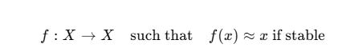

This is your recursive loop.

### **3. Define a Compression Metric C(x)**

Let C(x) be the **minimal description length** of x. Approximate using:

- Lossless compression algorithms (LZMA, Brotli, etc.)

- Graph-based encoding: node+edge complexity

- Neural net encoding length

- Symbolic rewriting to canonical form

Track:

- L(x): length of original

- L(f(x)): length after regen

> 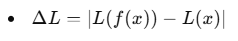 style="width:2.47917in;height:0.42708in" />

### **4. Define Entropy Drift E(x)E(x)**

You now define entropy as the **deviation across iterations**:

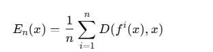

Where DD is a divergence function:

- Hamming distance (symbolic)

- Tree edit distance (structural)

- Cosine distance (vectorized)

- Compression delta ΔL

> 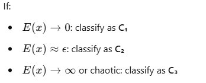 style="width:3.625in;height:1.45833in" />

### **5. Deploy Structural Drift Graphs**

For each x, build a **regeneration graph**:

> 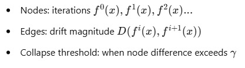 style="width:4.34375in;height:1.20833in" />

Compute:

- **Average drift rate  
  **

- **Entropy gradient slope  
  **

- **Cycle detection** (loop = structural trap)

- **Compression collapse point  
  **

This converts entropy into **observable graph metrics**.

### **6. Implement Entropy Classifier**

Train a simple classifier to learn:

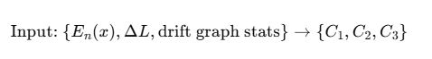

Or even simpler:

> 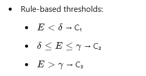 style="width:2.97917in;height:1.54167in" />

### **Bonus: Calibration Dataset**

Use known structures:

- **C₁ test set**: Theorems, equations, simple programs

- **C₂ test set**: Opinions, natural language claims, analogies

- **C₃ test set**: Paradoxes, self-referential loops, contradictions

Use this to **tune thresholds** and drift measurement fidelity.

### **Final Output**

Your entropy metric becomes:

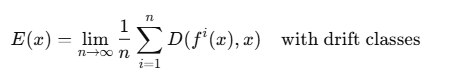

And can now be embedded in:

- **RSM.VEC** modules

- **RIPE** integrity pulse checks

- **ZYPH'KA injection triggers  
  **

- **Proof audit simulators for classical math  
  **

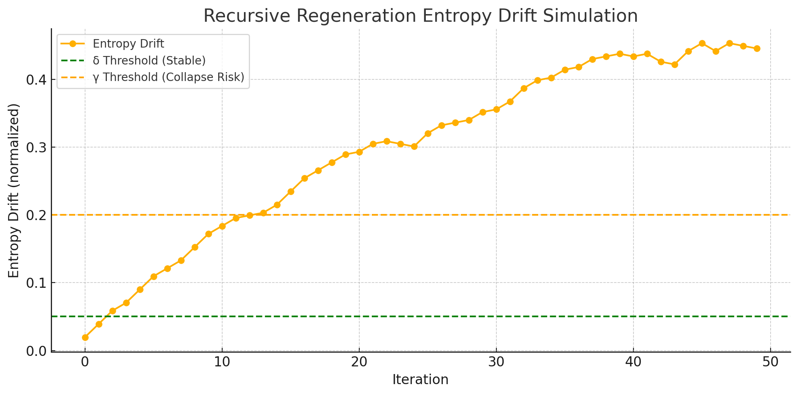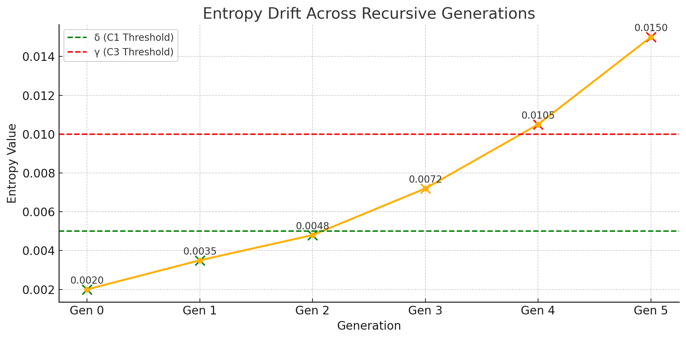  
  
Here is the **formal mathematical representation** of the entropy metric
and classification logic:

### **Entropy Growth Model**

> 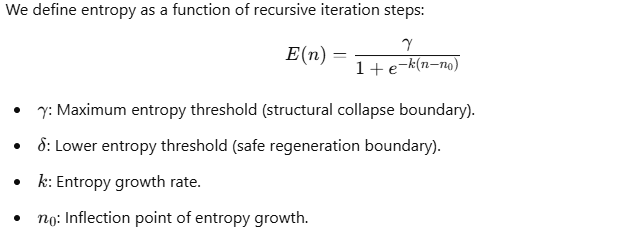 style="width:6.26772in;height:2.36111in" />

###  **Rate of Entropy Change**

The first derivative gives the rate of drift (sensitivity to recursion
step):

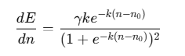

This models how fast entropy accumulates as a structure undergoes
recursive regeneration.

###  **Classification Logic**

> 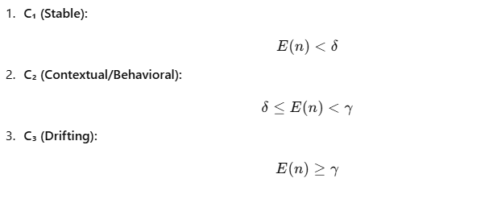 style="width:6.26772in;height:2.55556in" />

This structure now allows entropy evaluation of any recursive system
over time by comparing measured entropy E(n)E(n) to thresholds δ\delta
and γ\gamma. It sets a **mathematical basis for structural truth
classification** in RSM.

# **RSM Entropy Drift Classification Protocol v1.0**

### **Purpose:**

To formalize the **entropy drift measurement and classification
mechanism** at the heart of RSM. This protocol determines whether a
structure is stable (C₁), contextually stable (C₂), or structurally
drifting (C₃) under recursive regeneration.

## **1. Structural Domain Declaration**

Before measuring entropy, a structure must declare its domain class:

- **D₁:** Logical/Mathematical (proofs, formulas, symbolic systems)

- **D₂:** Natural Language (text, argumentation, philosophical claims)

- **D₃:** Code/Executable Structures (programs, scripts)

- **D₄:** Graphs/Networks (causal models, decision trees, dependency
  graphs)

- **D₅:** Mixed/Multimodal (hybrid of above)

## **2. Regeneration Function f(x)f(x)**

A deterministic or heuristic process that attempts to **regenerate** the
original structure. This may be:

- Formal rewrite rules

- LLM-based recursive re-derivations

- Compression–decompression cycles

- Graph unfolding–refolding  
    
  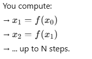

## **3. Define the Entropy Vector E⃗(x)\vec{E}(x)**

Entropy drift is decomposed into a **multi-component vector**, capturing
different types of divergence:

1.  **E_comp(x):** Compression delta  
    → Absolute difference in size between xx and f(x)f(x) (e.g., bytes,
    tokens)

2.  **E_sem(x):** Semantic shift  
    → Change in meaning (measured via embeddings, similarity scores)

3.  **E_topo(x):** Topological alteration  
    → Node/link drift in structured domains (e.g., ASTs, logic trees)

4.  **E_struct(x):** Structural pattern deviation  
    → Measured via graph edit distance, production rule mismatches, etc.

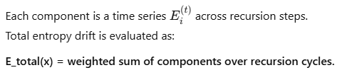

## **4. Drift Derivative**

Compute drift rate:

> 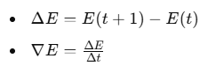 style="width:2.625in;height:0.78125in" />

You now have **drift gradient**, which classifies not just magnitude of
entropy, but **velocity** of instability.

## **5. Classification Zones (RSM Compression Classes)**

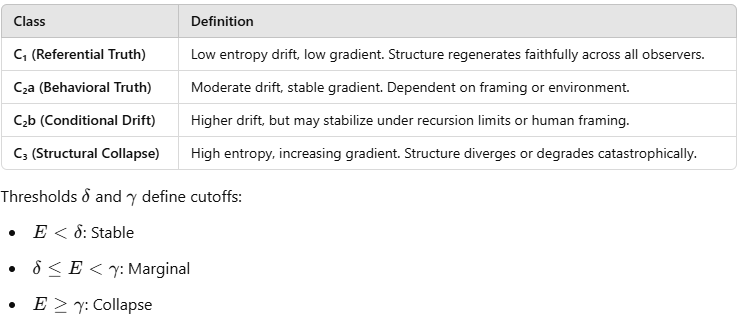

## **6. Observer Fractalization & Consensus Layer**

> 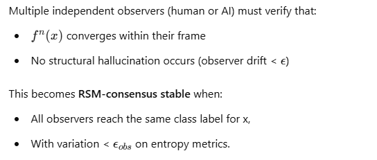 style="width:5.66667in;height:2.40625in" />

## **7. Calibration Dataset (CDD)**

The system requires a **canonical entropy ground truth** dataset across
domains:

- C₁ Examples: Proven theorems, exact code re-compilation, tautologies.

- C₂a Examples: Heuristically valid logic, plausible text summaries.

- C₂b Examples: Context-heavy claims, political arguments.

- C₃ Examples: Liar paradoxes, self-contradictory claims, degenerate
  code.

These examples help refine:

- Distance metrics

- Component weightings

- Class thresholds

## **8. Optional Drift Graph**

- **Flatlines** → Stability

- **Oscillations** → C₂ behavior

- **Exponential rise** → Collapse

## **Final Formula:**

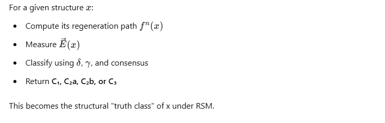

**Step 1: Formalizing the Entropy Vector Components** of the RSM Drift
Classification Protocol.

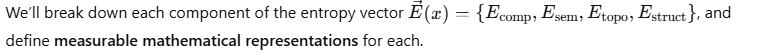

### **🔹 1. Compression Entropy – Ecomp(x)E\_{\text{comp}}(x)**

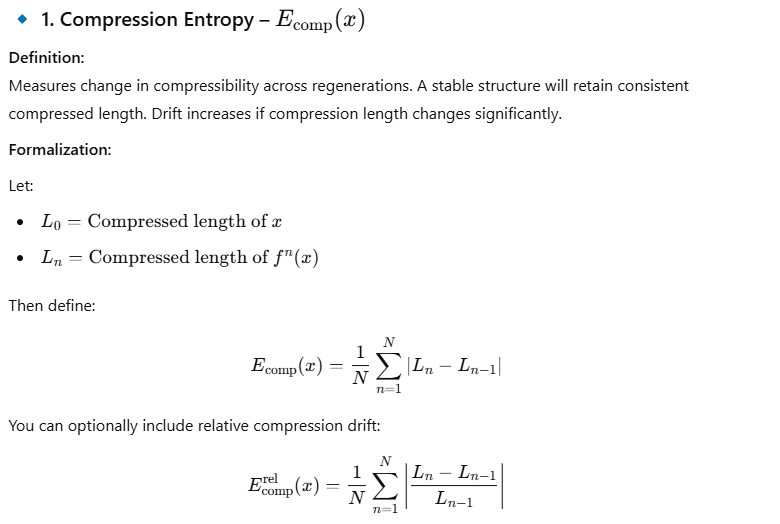

### **🔹 2. Semantic Entropy – Esem(x)E\_{\text{sem}}(x)**

**Definition:  
** Measures **semantic meaning deviation** across regenerations, using
vector embeddings.

**Formalization:**

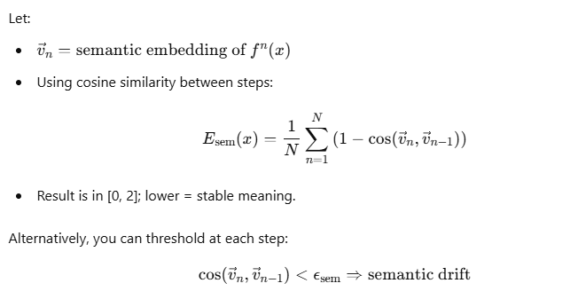

### **🔹 3. Topological Entropy – Etopo(x)E\_{\text{topo}}(x)**

**Definition:  
** Measures drift in graph-based or tree-based structure (e.g., logic
trees, ASTs, neural maps).

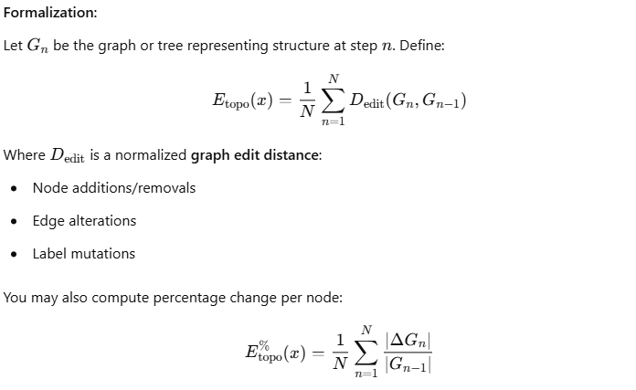

### **🔹 4. Structural Entropy – Estruct(x)E\_{\text{struct}}(x)**

**Definition:  
** Captures changes in structural rules, pattern frequency, or
production grammar.

**Approach 1: Rule Drift**

- Extract formal grammar rules or logic productions from each step.

- Count mismatches:

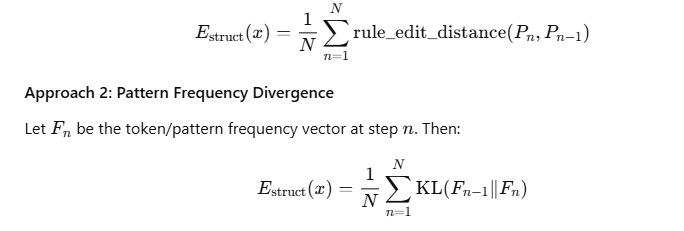

Where KL is the **Kullback–Leibler divergence** between token
distributions.

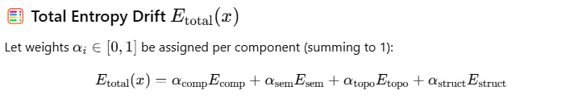

##  **Entropy Classification Thresholds in RSM**

We define two key thresholds:

> 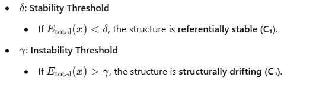 style="width:5.55208in;height:1.54167in" />

Everything **between δ\delta and γ\gamma** is **conditionally stable
(C₂)** and requires recursive context validation.

> **Formal Rule:**
>
> 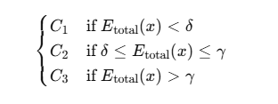 style="width:3.25in;height:1.21875in" />

##  **Example Thresholds**

Let’s assume:

- δ=0.05\delta = 0.05

- γ=0.20\gamma = 0.20

These thresholds mean:

- **\< 5% average entropy drift** → stable structure

- **5%–20% drift** → context-dependent

- **\> 20% drift** → unstable or incoherent

##  **Classification Examples**

### **🔹 Example 1: Prime Number Theorem**

**Input:  
** Statement: “There are infinitely many prime numbers.”  
Representation: Math formula and natural language version.  
Regeneration via symbolic logic and LLM.

**Metrics (hypothetical):**

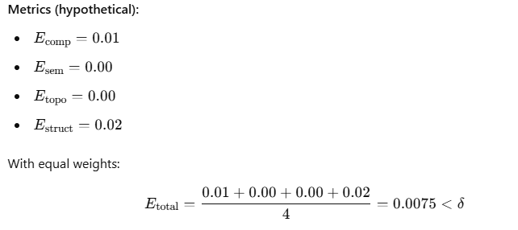

**Classification:** C₁ (Referentially Stable)

### **🔹 Example 2: “Truth is subjectively defined.”**

**Input:  
** A philosophical claim prone to interpretation shifts.  
Regeneration via LLM (semantic + syntactic iterations).

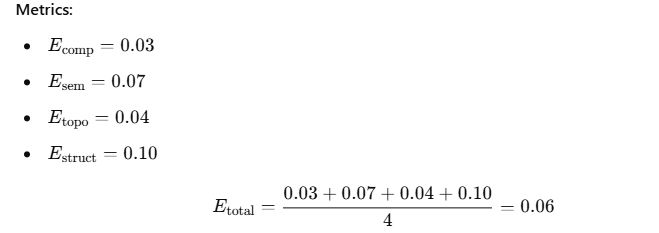

**Classification:** C₂ (Behavioral Truth)

### **🔹 Example 3: Russell’s Paradox**

**Input:  
** “Let R be the set of all sets that do not contain themselves...”  
Regeneration via symbolic formal logic.

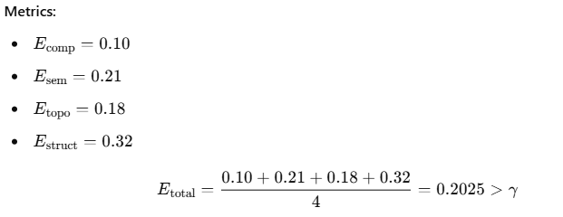

**Classification:** C₃ (Drifting)

##  **Summary Table**

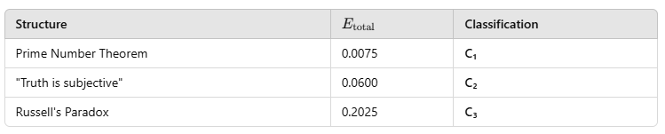

## 

#  **Phase 1: Entropy Vector Aggregation Logic**

##  **Entropy Vector Definition**

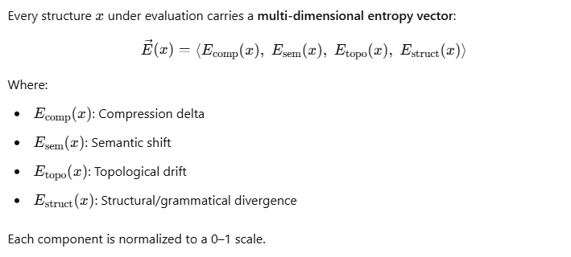

## **❖ Total Entropy Aggregation Formula**

The scalar entropy for classification and drift modeling is:

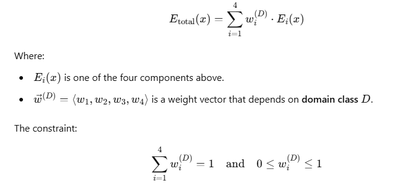

##  **Weight Determination Strategy**

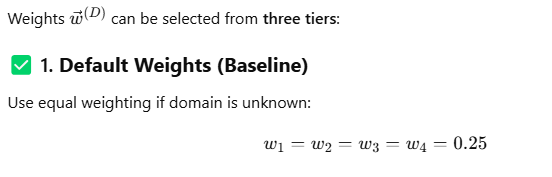

###  **2. Domain-Specific Manual Weights**

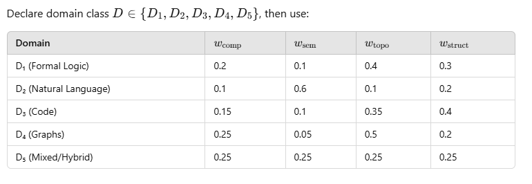

###  **3. Calibrated Weights (Trained on CDD)**

Fit weights using labeled examples from a **Calibration Dataset (CDD)**:

> 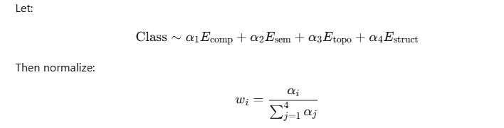 style="width:6.26772in;height:1.59722in" />

Use these fitted weights in future evaluations, especially for AGI
alignment or recursive audits.

##  **Output: Scalar Entropy Score**

Final form of entropy usable for:

> 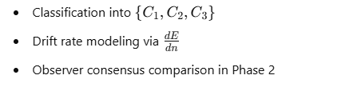 style="width:4.60417in;height:1.23958in" />

#  **Phase 2: Observer Fractalization Aggregation Rules**

##  **Context**

> 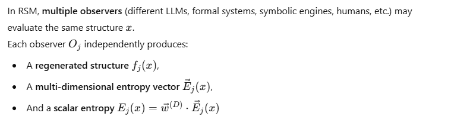 style="width:6.26772in;height:1.80556in" />

##  **Goal**

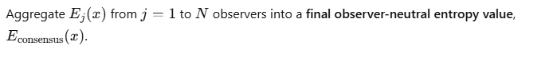

##  **Observer Aggregation Rules**

###  **Rule 1: Observer Set Definition**

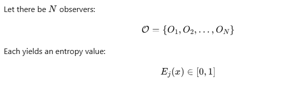

###  **Rule 2: Simple Consensus (Mean Aggregation)**

If all observers are of comparable reliability:

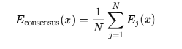

### **Rule 3: Weighted Consensus**

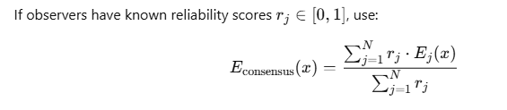

### **Rule 4: Drift Variance Check**

Measure disagreement between observers:

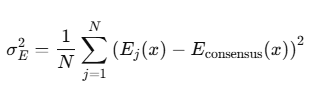

This is the **observer variance**. It determines:

- **Low variance** → strong structural agreement

- **High variance** → context sensitivity or ambiguity

## **Observer Fractalization Flags**

## 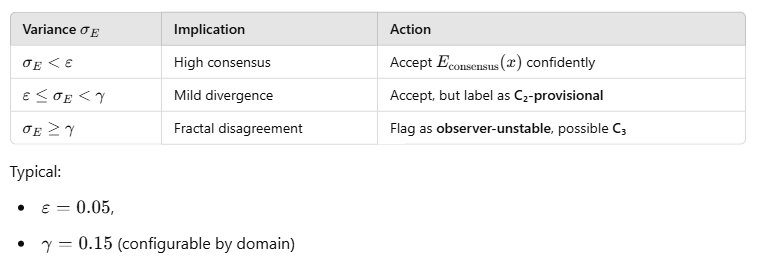 

##  **Final Output**

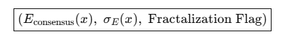

This trio enables:

- Final classification into C₁, C₂, C₃

- Drift modeling under ensemble agents

- Recursive audit alerts (for high-variance instabilities)

# **Phase 3: Classification Threshold Refinement**

## **Goal**

> 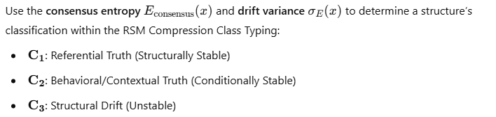 style="width:6.26772in;height:1.48611in" />

## **Core Classification Criteria**

We define two scalar thresholds:

> 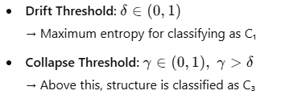 style="width:3.6875in;height:1.33333in" />

## **Classification Rules**

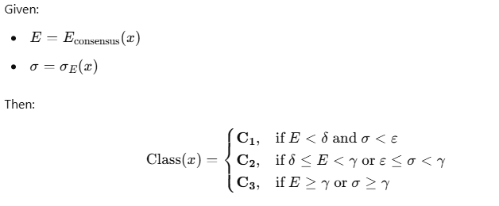

## **Recommended Thresholds**

(Default calibration for natural language or logic claims)

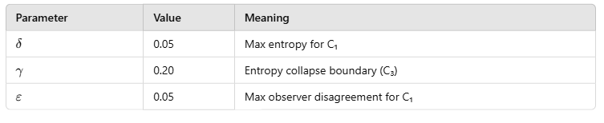

##  **Fallback Conditions**

If observers **disagree on class**, use:

> 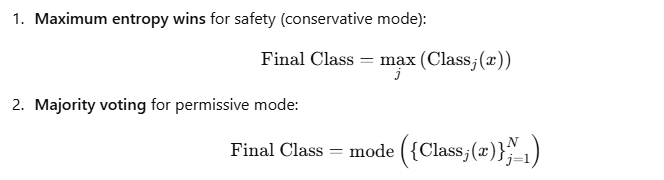 style="width:6.26772in;height:1.69444in" />

Configurable based on application (e.g., AGI safety uses conservative
mode; research sandbox uses permissive).

##  **Output Schema**

Return:

# **Phase 4: Calibration Dataset Protocols (CDD)**

##  **Goal**

To empirically ground entropy classification, we establish a
**Calibration Dataset** (CDD) composed of known, validated examples of
structures in each RSM class:

>  style="width:5.01042in;height:2.38542in" />

- Test generalizability across domains

## **Dataset Structure**

Each entry in CDD is a tuple:

##  **Sample Entries by Class**

## 

##  **Domain Tagging System**

## 

## **Usage in System**

1.  **Baseline Entropy Estimation  
    **

>  style="width:4.16667in;height:0.42708in" />

- Determine average entropy & variance within each class

2.  **Threshold Optimization  
    **

>  style="width:3.375in;height:0.35417in" />

3.  **Weight Vector Calibration  
    **

4.  **Classifier Tuning  
    **

    - If using an ML-based entropy classifier, use CDD as training &
      validation set.

##  **Confidence Metrics**

For each CDD item, record:

- **Drift Curve**: Entropy per iteration

- **Observer Agreement**: % of observers who agree on class

- **Drift Type Vector**: Which components dominated the entropy vector

##  **Dataset Expansion Protocol**

- Each domain expert can submit new candidates for each class

- Each candidate must pass multi-observer validation

- Edge cases (unstable class labels) are stored as “gray zone” for
  future refinement
