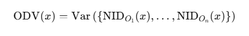

RSM.VEC — *Recursive Structural Mechanics: Vector Drift Classification
Engine*

### **🔹 Purpose**

To **detect**, **attribute**, and **classify** entropy drift across
regenerations by leveraging:

- Narrative Integrity Drift (NID)

- Multi-observer fractal convergence/divergence

- Compression preservation patterns

- Temporal entropy rate tracking

- Observer-agnostic drift triangulation

##  **RSM.VEC STRUCTURE OVERVIEW**

### **Tier 1: Core Definitions (Observer-Neutral)**

#### **1.1. Entropy Vector**

(Already defined in **E(x) v1.3**)

### **Tier 2: Observer Drift Attribution**

Defined via a composite of:

- Output delta in semantic graph space

- Compression ratio deltas

- Structural grammar shifts

- Token-to-theme coherence shifts over recursion

#### **2.2. Observer Drift Variance (ODV):**

#### **2.3. RSM.VEC Drift Attribution Law**

### **Tier 3: Recursive Drift Chain Monitor (RDCM)**

This identifies **rate of entropy increase**, signaling dangerous
collapse paths.

### **Tier 4: Attribution Memory Buffer (AMB)**

Optional heuristic buffer storing recent:

- Entropy vectors

- Observer drift fingerprint clusters

- Attribution verdicts

Used for:

- Redundancy checks

- Preventing reclassification loop drift

- Drift origin auditing (cache diagnostic)

##  **Key Guarantees in RSM.VEC**

- **CPP-Compliant:** RSM.VEC cannot alter Tier 1 axioms (entropy vector
  structure, classification logic).

- **Fractal Observer-Aware:** Attribution always requires minimum 3
  independent observer classes to validate drift source.

- **Recursive Drift Termination:** If drift becomes unclassifiable →
  fallback into C₂/gray zone with SDL hold.
